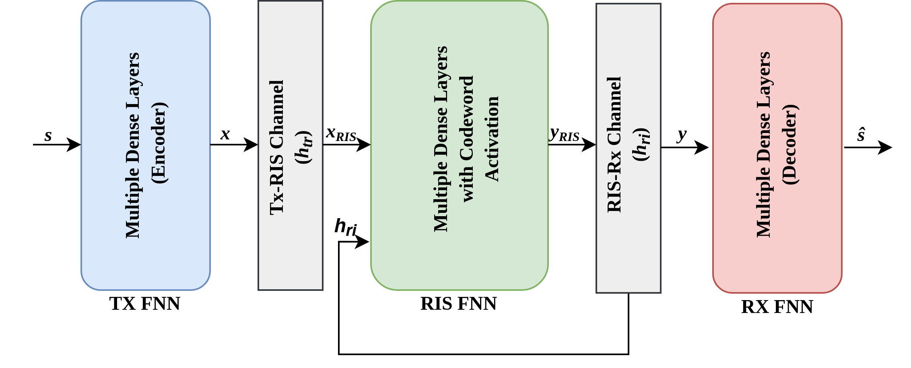
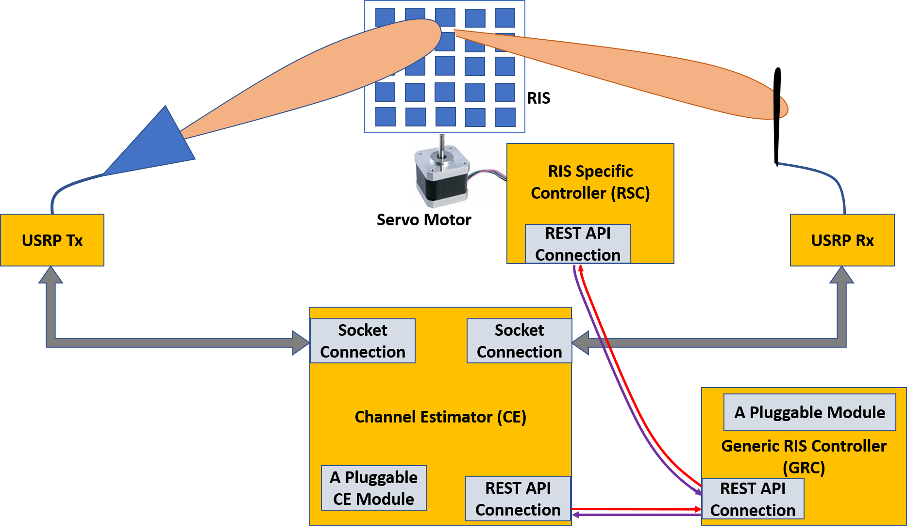

## About

 
Curious explorer with a persistent drive for innovation in Science and Technology. I bring a solid academic foundation in Computer Science Engineering and a Master's in Data Science and Artificial Intelligence. As a researcher, my journey has led me to dive into projects that span crafting intelligent 6G Communication solutions to leveraging Machine Learning models for real-world applications such as speaker identification and adaptive algorithms for innovative ambulance systems. With a toolkit that includes TensorFlow, PyTorch, and more, I thrive in collaborative environments, fostering interdisciplinary teamwork to create impactful solutions. 

## Education 
  - **Master of Technology**, CSE, Specialization: DS&AI | *International Institute of Information Technology, Naya Raipur* | _August 2019 - July 2021_
  - **Bachelor of Engineering**, CSE | *Shri Shankaracharya Technical College, Bhilai* | _August 2015 - July 2019_

## Research Experience
**Project Research Engineer** | Indian Institute of Technology, Bombay \
   **Supervisor**: _April 2024 - Present_ \
   **Project Title**: *Development of Smart Drone Ecosystem and Demonstration of Social Applications Towards Larger Drone Deployment Strategy of Maharashtra.*
   - Working on the drone communication, specifically drone-to-drone, drone-to-ground control station (GCS), and drone-to-docking station.
   - Currently working on drone swarm communication in ros based rpi-setup along with Cube Orange + and RFD modem.
   - Exploring state-of-the-art protocols to establish the reliable and efficient connection between the sensors and drone.

 **Junior Research Fellow** | Indian Institute of Technology, Bhilai \
   **Supervisor**: _November 2022 - December 2023_ \
   **Project Title**: *Smart Radio Environments: Implementation And Deployment For Targeted Use-Cases.*
   - Collaborating on Self-Supervised Learning models for wireless Channel Estimation.
   - Developed Autoencoder model, Flask REST APIs, service discovery protocol and participated in TSDSI \
     standardization for IRS-based 6G wireless communication [1].
   - Developed prototype of IRS with Channel Estimator and IRS Generic Controller [2].
   
  **Junior Research Fellow** | *Indian Institute of Technology, Bhilai*\
   **Supervisor**:  _March 2022 - October 2022_\
   **Project Title:** *Massive Multi-Access to Provide UHD Quality Video And Real-time Data Delivery From 
     a Connected Mobile Ambulance And Its Extension To Other Disaster Recovery Scenarios.*
   - Contributed to system architecture, algorithm development, and prototype development of massive\
     multi-access Rpi setup to provide UHD video streaming [3].
   - Developed a public Flask API server with the hospital web application.

 **Master’s Thesis** | *Collaborated Govivace-Inc & IIIT NR*\
   **Supervisor**:  _September 2020 - May 2021_\
   **Project Title**: *Speaker Accent Identification Using The Time Delay Neural Network Architecture For The
   Indian Language.*
   - Developed the Time Delay Neural Network model to identify Indian speakers’ accents.
   - Collected data from participants and analyzed data using Kaldi and Tensorflow.

## Projects
**Title**: ***Codebook Design and Autoencoder-based Codeword Selection for RIS-assisted Communications***

 
This project focuses on optimizing beamforming for Reconfigurable Intelligent Surfaces (RIS) in indoor settings. 
The codebook comprises phase patterns at RIS elements, directing signals to desired angles, and is designed to 
maximize the signal-to-noise ratio (SNR) at the receiver (RX). To reduce redundancy and enhance efficiency,
We've developed an algorithm that streamlines the codebook by eliminating repetitive codewords. Furthermore,
We employ an Autoencoder (AE) for codeword selection, minimizing the Bit Error Rate (BER) at the receiver.
Our approach demonstrates promising results in terms of BER reduction while maintaining a compact codebook 
size, surpassing existing techniques.

**Title**: ***Implementation of Smart Radio Environment***

 
This project showcases the implementation of an intelligent radio environment (SRE) communication system using
reconfigurable intelligent surfaces (RIS). Positioned between the transmitter and receiver, the RIS reflects 
incident waves in specific directions, enhancing signal quality.
The experimental setup comprises a channel estimator (CE), a generic RIS controller (GRC), and a RIS-specific 
controller (RSC), with USRP devices acting as the transmitter and receiver. The CE adjusts RIS settings based 
on throughput requirements, following TSDSI standards for interface and message exchange between the wireless system and RIS.
This standardized approach achieves a remarkable 20 dBm improvement in received power when deploying RIS.
Additionally, the GRC employs an algorithm to optimize beamforming angles for maximum received power.

**Title**:  ***Smart-ambulance: Services using Multiple Network Paths and Open APIs***

 
This project focuses on improving patient care by integrating smart ambulance services with healthcare systems.
We introduce a solution for streaming high-definition video using multiple network paths and interfaces. 
Our approach optimizes video distribution and reliability, reducing delay and jitter in multi-access scenarios.
Additionally, we provide standardized APIs to access live data from smart ambulances, enhancing hospital system
responsiveness during critical situations. The portfolio includes product-level implementation details and real-world results,
validating our algorithms.

